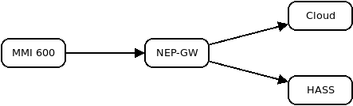

NEP-GW
------

This project allows to send the telemetry data of a Solovoltaic MMI-600 (which is a rebranded NEP BDM-600) to the NEP cloud and additionally to a Home Assistant installation.

Compilation
-----------

Use Arduino to compile and install it on a WT32-ETH01.

In `nep-gw.ino` you can change the SSID and password for the access point.  
In `mqtt.ino` you need to configure the addess of the MQTT server.

Usage
-----

The WT32-ETH01 creates a Wifi access point. Configure the MMI-600 to connect to it.

The data is now send over the ethernet interface to the NEP cloud and additionally via MQTT to Home Assistant.

